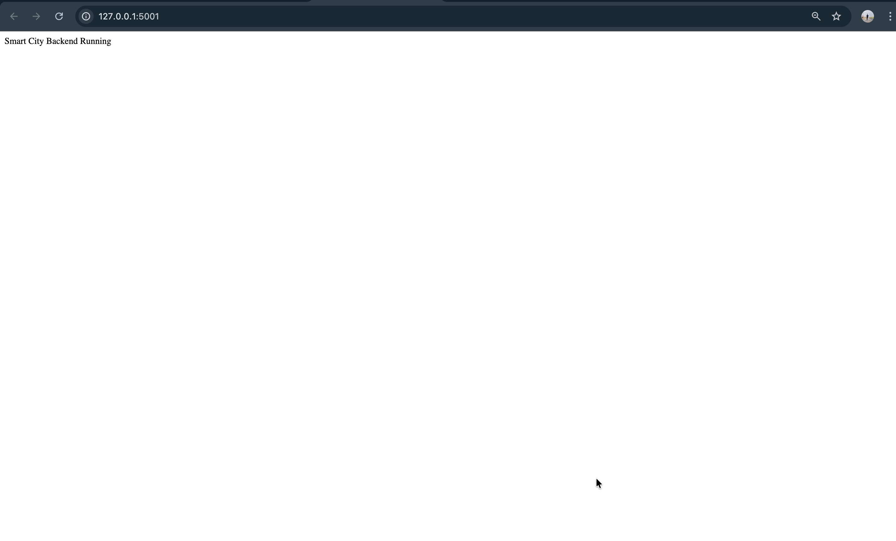
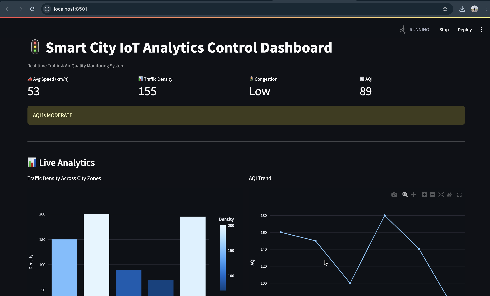
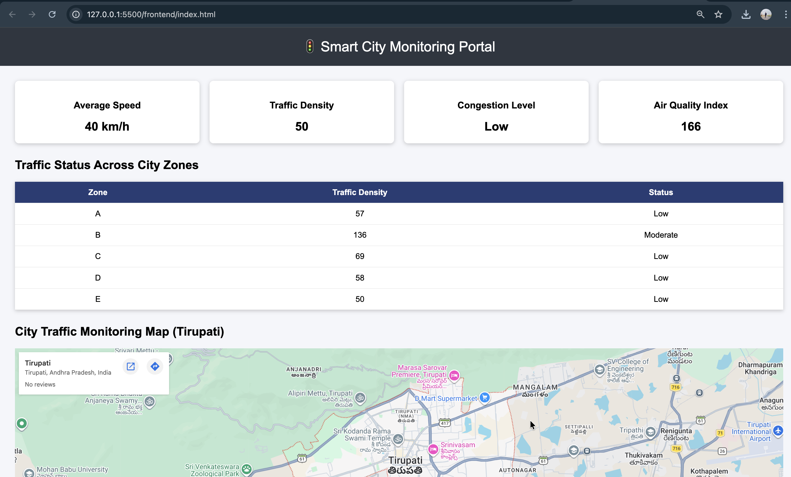

# 🚦 Smart City IoT Analytics for Traffic & Air Quality Monitoring

A **Smart City monitoring platform** that analyzes **traffic congestion and air quality** using **Machine Learning, Flask APIs, and interactive dashboards**.

This system predicts traffic density and AQI values and visualizes them through **Streamlit dashboards and an HTML monitoring portal**.

---

# 🌍 Project Overview

Urban cities face increasing problems with **traffic congestion and air pollution**.
This project provides a **data-driven monitoring system** to analyze city traffic and environmental conditions.

The system integrates:

* Machine Learning prediction models
* Flask REST APIs
* Interactive dashboards
* Smart city visualization tools

---

# 🏗️ System Architecture

Traffic Data → ML Model → Flask API → Dashboard Visualization

Components:

### 1️⃣ Machine Learning Model

* Predicts traffic congestion levels
* Estimates Air Quality Index (AQI)

### 2️⃣ Flask Backend API

Provides REST endpoints for predictions.

Example API output:

```
{
 "aqi": 94,
 "congestion": "Medium",
 "density": 60,
 "speed": 48
}
```

---

# 📊 Project Screenshots

## Backend API Running



---

## Prediction API Response


---

## Streamlit Analytics Dashboard



Features:

* Live traffic monitoring
* AQI analytics
* Interactive charts
* Smart city data visualization

---

## HTML Smart City Monitoring Portal



Features:

* Real-time traffic statistics
* AQI monitoring interface
* City traffic zone visualization

---

# ⚙️ Tech Stack

| Technology      | Purpose            |
| --------------- | ------------------ |
| Python          | Core programming   |
| Flask           | Backend API        |
| Streamlit       | Data dashboard     |
| HTML / CSS / JS | Frontend portal    |
| Scikit-Learn    | Machine Learning   |
| Pandas          | Data processing    |
| Plotly          | Data visualization |

---

# 📂 Project Structure

```
smart-city-iot-analytics
│
├── backend
│   ├── backend_app.py
│   ├── model.pkl
│   ├── scaler.pkl
│   └── requirements.txt
│
├── frontend
│   ├── frontend_dashboard.py
│   ├── index.html
│   ├── script.js
│   └── style.css
│
├── data
├── deployment
├── notebook
│
├── screenshots
│   ├── backend.jpg
│   ├── backend predict.jpg
│   ├── frontend.jpg
│   └── streamlit.jpg
│
└── README.md
```

---

# ▶️ How to Run the Project

### 1️⃣ Clone the Repository

```
git clone https://github.com/yourusername/smart-city-iot-analytics.git
```

---

### 2️⃣ Install Dependencies

```
pip install -r backend/requirements.txt
```

---

### 3️⃣ Run the Backend API

```
python backend/backend_app.py
```

Backend will run at:

```
http://127.0.0.1:5001
```

Prediction endpoint:

```
http://127.0.0.1:5001/predict
```

---

### 4️⃣ Run Streamlit Dashboard

```
http://localhost:8501/
```

---

### 5️⃣ Run HTML Monitoring Portal

Open:

```
http://127.0.0.1:5500/frontend/index.html
```

---

# ⭐ Key Features

* Real-time traffic monitoring
* AQI prediction and visualization
* Machine learning integration
* REST API architecture
* Interactive dashboards
* Smart city monitoring interface

---

# 📌 Future Improvements

* IoT sensor integration
* Live traffic camera feeds
* Cloud deployment
* Real-time AQI data integration

---

