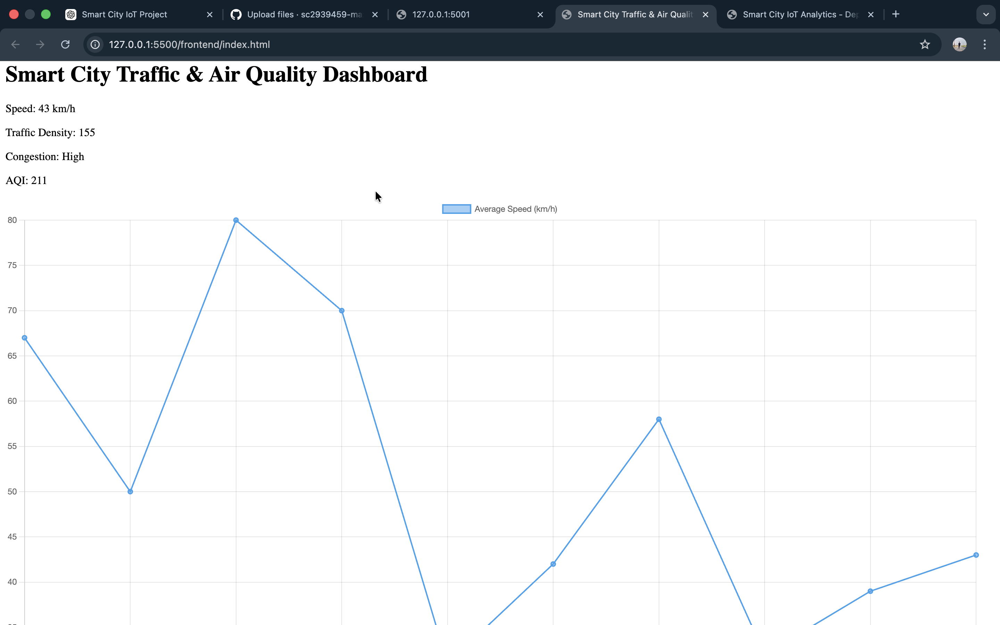
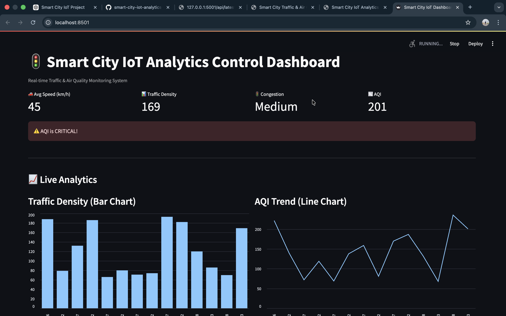
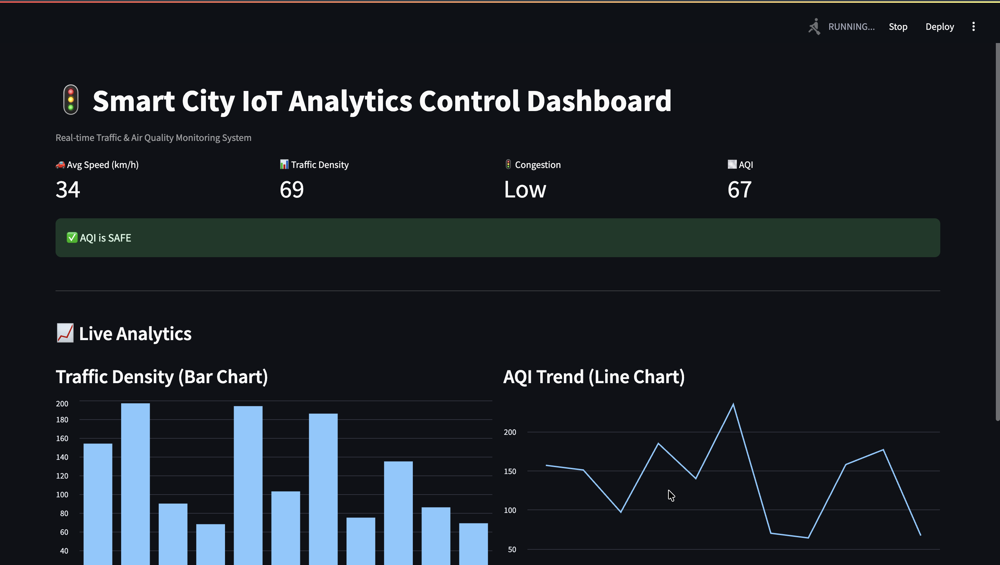

# 🚦 Smart City IoT Analytics for Traffic and Air Quality Monitoring

A real-time Smart City monitoring system that analyzes **traffic congestion and air quality** using **IoT sensor data and Machine Learning models**.
The system provides live analytics dashboards, predictive insights, and camera monitoring for urban traffic management.

---

## 📌 Project Overview

This project integrates:

* IoT Sensor Data
* Machine Learning Models
* Flask Backend API
* Streamlit Interactive Dashboard

The goal is to help cities monitor:

* 🚗 Traffic Density
* 🌫 Air Quality Index (AQI)
* 🚦 Traffic Congestion Levels
* 📊 Real-time Analytics

---

## ⚙️ Technology Stack

* **Python**
* **Machine Learning**
* **Flask API**
* **Streamlit Dashboard**
* **Pandas / Scikit-learn**
* **Plotly Visualization**

---

## 🧠 Machine Learning Models Used

* Logistic Regression
* Decision Tree
* Random Forest
* Gradient Boosting

The best model is selected using evaluation metrics.

---

## 🏗 Project Architecture

IoT Sensor Data
↓
Data Preprocessing & Feature Engineering
↓
Machine Learning Prediction
↓
Flask Backend API
↓
Streamlit Dashboard & Alerts

---

## 📊 Dashboard Features

* Live Traffic Density Monitoring
* Air Quality Index Visualization
* Traffic Congestion Prediction
* Smart City Analytics Dashboard
* Live Traffic Camera Monitoring

---

## 📂 Project Structure

```
backend/
    backend_app.py
    model.pkl
    scaler.pkl

frontend/
    frontend_dashboard.py

data/
    sensor dataset

deployment/

notebook/
    project.ipynb
```

---

## ▶️ How to Run the Project

### 1️⃣ Install Dependencies

```
pip install -r requirements.txt
```

---

### 2️⃣ Start Backend API

```
python backend/backend_app.py
```

Backend runs on:

```
http://127.0.0.1:5001
```

---

### 🔹 Web Dashboard (Frontend)
Traffic and air-quality monitoring dashboard built using HTML, CSS, and JavaScript.



---

### 🔹 Deployment Dashboard (Render)
Cloud deployment of Flask backend service.



---

### 🔹 Streamlit Analytics Dashboard
Interactive analytics dashboard with live visualization and alerts.



## ⚙️ How to Run the Project Locally

### 1️⃣ Clone Repository

git clone https://github.com/sc2939459-max/smart-city-iot-analytics-for-traffic-and-air-quality-monitoring.git
cd smart-city-iot-analytics-for-traffic-and-air-quality-monitoring

###2️⃣ Install Dependencies
pip install -r requirements.txt

###3️⃣ Run Flask Backend
python backend/app.py
API runs at:
http://127.0.0.1:5001

###4️⃣ Run Streamlit Dashboard
streamlit run deployment/app.py
Dashboard opens at:
http://localhost:8501
