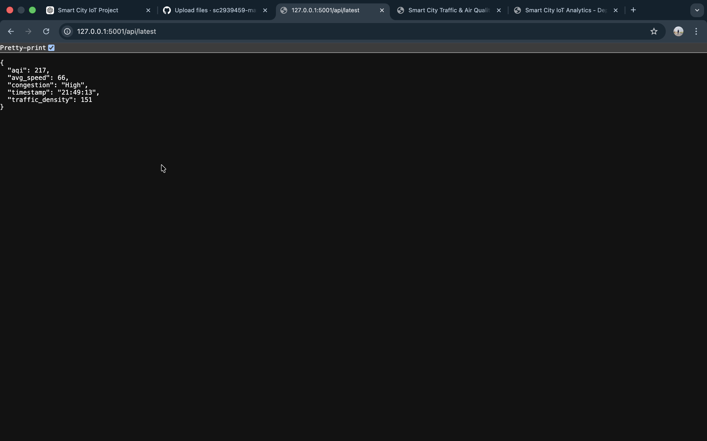

# Smart City IoT Analytics for Traffic and Air Quality Monitoring

## 📌 Project Overview
This project presents a Smart City IoT Analytics system designed to monitor and analyze real-time traffic conditions and air quality levels using data analytics and machine learning techniques.

The system collects traffic and environmental parameters, processes them through a backend API, and visualizes live analytics on an interactive dashboard.

---

## 🎯 Objectives
- Monitor real-time traffic density and vehicle speed
- Analyze congestion levels dynamically
- Predict Air Quality Index (AQI)
- Provide visual insights using an interactive dashboard
- Demonstrate integration of IoT, Machine Learning, and Web Technologies

---

## 🏗️ System Architecture

IoT Data Sources  
⬇  
Data Preprocessing & Feature Engineering  
⬇  
Machine Learning Model  
⬇  
Flask Backend API  
⬇  
Frontend Dashboard (Chart.js Visualization)

---

## 🧠 Technologies Used

### Programming & Backend
- Python
- Flask
- Flask-CORS

### Machine Learning
- Scikit-learn
- Pandas
- NumPy

### Frontend
- HTML
- CSS
- JavaScript
- Chart.js

### Tools
- VS Code
- Git & GitHub

---

## 📊 Dataset Information

### Traffic Dataset
- Vehicle count
- Average speed
- Traffic density
- Simulated smart city traffic conditions

### Air Quality Dataset
- PM10
- NO₂
- CO
- AQI values

Used for traffic analytics and AQI prediction.

---

## ⚙️ Features
- Real-time API data simulation
- Live dashboard updates
- Traffic speed visualization
- Congestion level indicators
- AQI monitoring
- Dynamic chart updates every 5 seconds

---
## 📸 Project Screenshots

### Backend API Response


### Web Dashboard (Frontend)


### Deployment Dashboard


## 🚀 How to Run the Project

### 1. Clone Repository
```bash
git clone https://github.com/sc2939459-max/smart-city-i’ot-analytics-for-traffic-and-air-quality-monitoring.git
cd smart-city-iot-analytics-for-traffic-and-air-quality-monitoring
```

### 2. Create Virtual Environment
```bash
python -m venv venv
source venv/bin/activate     # Mac/Linux
venv\Scripts\activate        # Windows
```

### 3. Install Dependencies
```bash
pip install -r deployment/requirements.txt
```

### 4. Run Backend API
```bash
python deployment/deploy_app.py
```

API runs at:
```
http://127.0.0.1:5001/api/latest
```

### 5. Run Frontend Dashboard
Open:

```
frontend/index.html
```

(using Live Server or browser)

