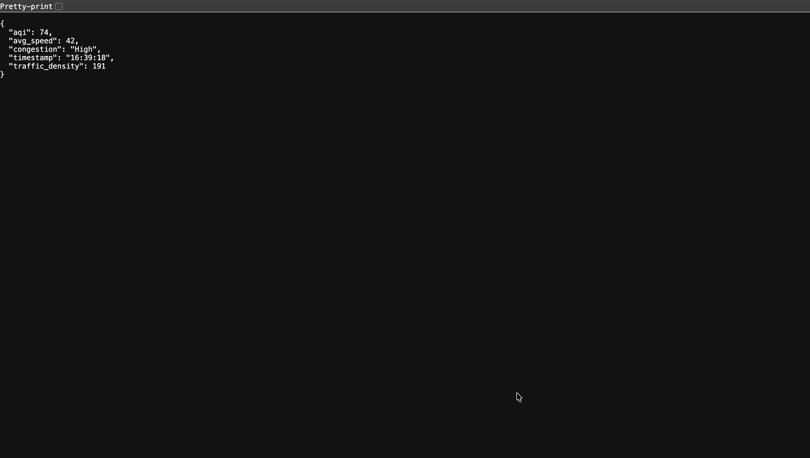

# 🚦 Smart City IoT Analytics for Traffic and Air Quality Monitoring

A real-time Smart City Analytics platform that monitors **traffic density**, **vehicle speed**, and **air quality (AQI)** using Machine Learning, Flask APIs, and an interactive Streamlit dashboard.

This project demonstrates end-to-end integration of:

- IoT Data Simulation
- Data Analytics & Machine Learning
- Backend API Development
- Real-time Dashboard Visualization
- Cloud Deployment

---

## 📌 Project Overview

Modern smart cities require continuous monitoring of traffic congestion and environmental pollution.  
This system collects traffic and air quality data, processes it using ML models, exposes predictions through a backend API, and visualizes insights through an interactive dashboard.

---

The workflow:
IoT Sensor Data
↓
Data Preprocessing & Feature Engineering
↓
Machine Learning Model
↓
Flask Backend API
↓
Streamlit Dashboard & Alerts

---

---

## 🎯 Objectives

- Monitor real-time traffic density and vehicle speed
- Predict Air Quality Index (AQI)
- Detect congestion levels dynamically
- Provide live analytics dashboards
- Demonstrate full-stack ML deployment

---

## 🏗️ System Architecture

- **Data Layer** → IoT dataset
- **ML Layer** → Prediction model
- **Backend** → Flask REST API
- **Frontend** → Streamlit Dashboard
- **Deployment** → Render Cloud

---

## 🧠 Technologies Used

- Python
- Pandas, NumPy
- Scikit-learn
- Flask (Backend API)
- Streamlit (Dashboard)
- Matplotlib / Visualization
- GitHub & Render (Deployment)

---

## 🚀 Live Demo

### 🌐 Streamlit Dashboard (Deployed)

👉 **Live Application:**  
http://localhost:8501/

---

## 📸 Project Screenshots

### 🔹 Backend API Response
Real-time JSON response from Flask backend API.



---

### 🔹 Web Dashboard (Frontend)
Traffic and air-quality monitoring dashboard built using HTML, CSS, and JavaScript.


---

### 🔹 Deployment Dashboard (Render)
Cloud deployment of Flask backend service.


---

### 🔹 Streamlit Analytics Dashboard
Interactive analytics dashboard with live visualization and alerts.


## ⚙️ How to Run the Project Locally

### 1️⃣ Clone Repository

```bash
git clone https://github.com/YOUR_USERNAME/smart-city-iot-analytics-for-traffic-and-air-quality-monitoring.git
cd smart-city-iot-analytics-for-traffic-and-air-quality-monitoring
